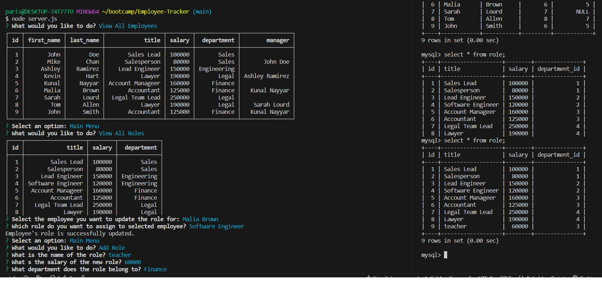

# Employee Tracker

Employee Tracker is a command-line application built with JavaScript and MySQL. It utilizes the npm packages Inquirer and mysql to enable users to connect to a database and view and manage departments, roles, and employees. The application is run using the command `node server.js` and presents a main menu with various options.

## Features

The Employee Tracker application provides the following features:

- **View All Departments**: Selecting this option presents a formatted table showing department names and department IDs.
- **View All Roles**: Choosing this option displays a table with job titles, role IDs, the departments to which the roles belong, and the corresponding salaries.
- **View All Employees**: This option presents a formatted table showing employee data, including employee IDs, first names, last names, job titles, departments, salaries, and the managers to whom the employees report.
- **Add a Department**: Selecting this option prompts the user to enter the name of the department, which is then added to the database.
- **Add a Role**: This option allows the user to enter the name, salary, and department for a new role, which is then added to the database.
- **Add an Employee**: Choosing this option prompts the user to enter the employee's first name, last name, role, and manager, and the employee is added to the database.
- **Update an Employee Role**: When selecting this option, the user is prompted to choose an employee to update and their new role. The employee's information is then updated in the database.

## Mockup

Here is a mockup of the Employee Tracker application:

```
Employee Tracker

Main Menu:
View All Departments
View All Roles
View All Employees
Add a Department
Add a Role
Add an Employee
Update an Employee Role
Quit

Please use arrow keys to choose:
```



## Installation

To use the Employee Tracker application, please ensure you have the following prerequisites:

- Node.js installed on your machine
- MySQL installed and running

Follow these steps to get started:

1. Clone this repository to your local machine.
2. Open a command line interface and navigate to the project's directory.
3. Install the required npm packages by running the command `npm install`.
4. Configure the database connection settings in the `server.js` file.
5. Import the database schema provided into your MySQL server.
6. Start the application by running the command `node server.js`.

## License

This project is licensed under the [MIT License](LICENSE).

## Questions or Feedback

If you have any questions or feedback regarding this application, please contact me at [PD@gmail.com].

---

Please note that the above mockup is for illustrative purposes and the actual application may have a different user interface.
